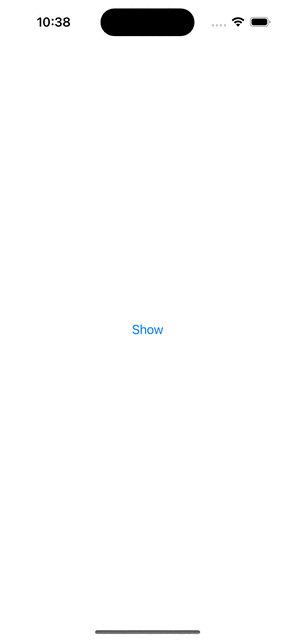

# LeakDetector

Example app for the 3-June-2023 meeting of a Flock of Swifts showing how to use duplicate items as a proxy for detecting links in your app.

* Use fo UNNotificationCenter for local notifications
* Use of RAII to delegate the respondsibilty for duplicate item reporting
* Debug menu to see the duplicate results

